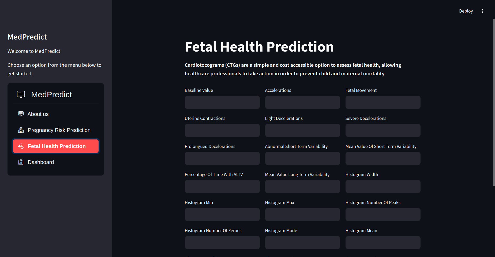
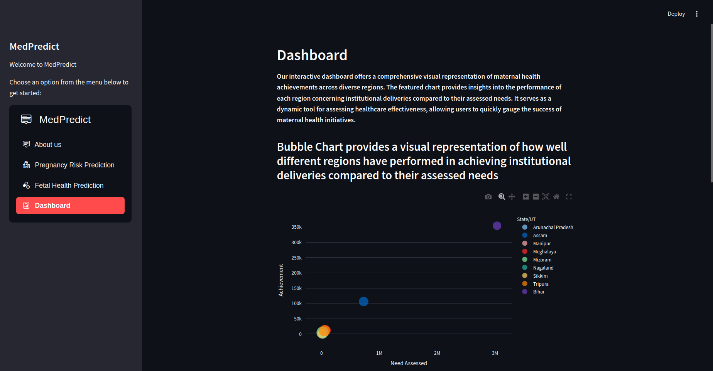
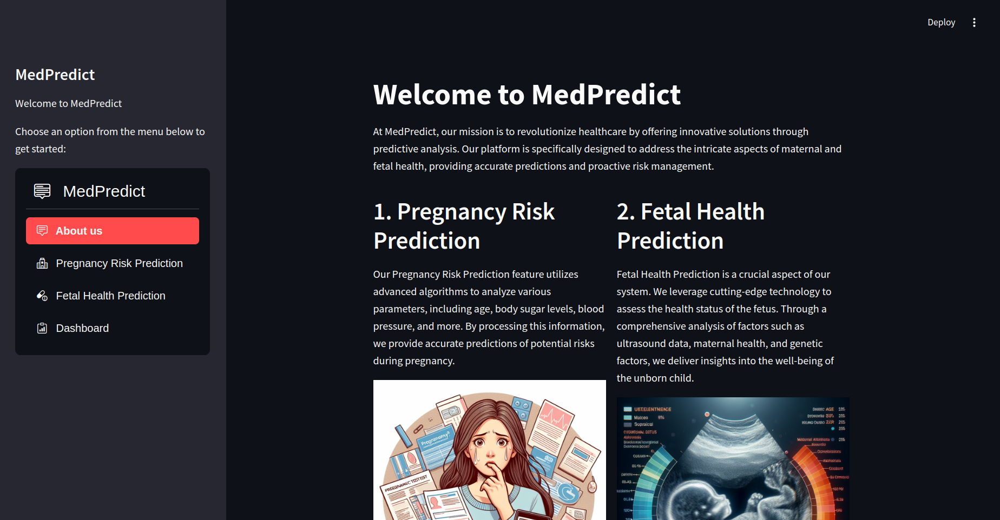
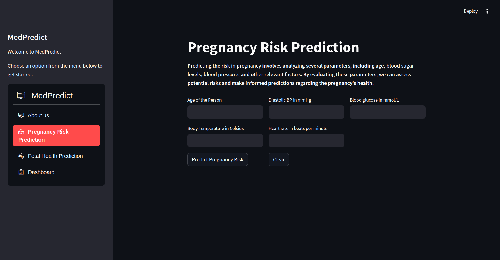

# MedPredict - Advanced Maternal and Fetal Health Prediction Platform

## Introduction

Welcome to MedPredict, an innovative platform dedicated to advancing maternal and fetal health through predictive analysis. MedPredict empowers healthcare professionals and users alike by providing accurate predictions and proactive risk management related to pregnancy.

MedPredict is a machine learning project designed to predict maternal health risks and classify fetal health status. This project leverages two datasets to enhance the accuracy and reliability of predictions, ultimately aiming to reduce maternal and child mortality rates.

## Table of Contents

- [Project Overview](#project-overview)
- [Datasets](#datasets)
  - [Maternal Health Risk Data](#maternal-health-risk-data)
  - [Fetal Health Classification](#fetal-health-classification)
- [WebApp URL](#webapp-url)
- [Key Features](#key-features)
- [Installation](#installation)
- [Contributing](#contributing)
- [License](#license)


## Project Overview

MedPred is built to assist healthcare professionals in predicting health risks for pregnant patients and classifying fetal health as normal, suspect, or pathological. By analyzing key health indicators and utilizing advanced machine learning algorithms, MedPred provides valuable insights that can lead to timely and informed medical interventions.

## Datasets

### Maternal Health Risk Data

- **Description**: This dataset is collected from different hospitals, community clinics, and maternal health care centers through an IoT-based risk monitoring system.
- **Link**: [Maternal Health Risk Data](https://www.kaggle.com/datasets/csafrit2/maternal-health-risk-data)
- **Attributes**:
  - `Age`: Age in years when a woman is pregnant.
  - `SystolicBP`: Upper value of Blood Pressure in mmHg.
  - `DiastolicBP`: Lower value of Blood Pressure in mmHg.
  - `BS`: Blood glucose levels in mmol/L.
  - `HeartRate`: Normal resting heart rate in beats per minute.
  - `Risk Level`: Predicted Risk Intensity Level during pregnancy.

### Fetal Health Classification

- **Description**: This dataset aims to classify the health of a fetus as Normal, Suspect, or Pathological using CTG data.
- **Link**: [Fetal Health Classification](https://www.kaggle.com/datasets/andrewmvd/fetal-health-classification)
- **Context**: This dataset is crucial in reducing child and maternal mortality by providing a cost-effective way to assess fetal health through Cardiotocogram (CTG) exams.
- **Data**: Contains 2126 records with features extracted from CTG exams, classified by three expert obstetricians.


## Webapp URL
MedPredict: [MedPredict link](https://mastersoham07-medpredict---advanced-maternal-and-fe-main-kwy5lb.streamlit.app/)

## Key Features

- **Pregnancy Risk Prediction:** Our Pregnancy Risk Prediction feature utilizes advanced algorithms to analyze various parameters, including age, body sugar levels, blood pressure, and more. By processing this information, we provide accurate predictions of potential risks during pregnancy.

- **Fetal Health Prediction:** Cardiotocograms (CTGs) are a simple and cost accessible option to assess fetal health, allowing healthcare professionals to take action in order to prevent child and maternal mortality

- **Dashboard:** Our Dashboard provides a user-friendly interface for monitoring and managing health data. It offers a holistic view of predictive analyses, allowing healthcare professionals and users to make informed decisions. The Dashboard is designed for ease of use and accessibility.

<!-- <p align="center">
     

</p>

<p align="center">
     

</p> -->


<br>

<br>

<br>

<br>

## Installation

Follow these steps to run the Streamlit code locally:

### Clone the Repository

```bash
git clone https://github.com/your-username/MedPredict---Advanced-Maternal-and-Fetal-Health-Prediction-Platform.git
cd medpredict
```
### Install Dependencies
 ```bash
 pip install -r requirements.txt
 ```
 ### Run the Streamlit App
 ```bash
streamlit run main.py
```
This will launch the Streamlit app locally. Open your web browser and navigate to the provided local address to explore MedPredict.

## Contributing

We welcome contributions to enhance the MedPred project. To contribute, please follow these steps:

### Fork the repository.

### Create a new branch

```bash
git checkout -b feature/your-feature-name
```
### Make your changes and commit them

```bash
git commit -m 'Add some feature'
```

### Push to the branch:

```bash
git push origin feature/your-feature-name
```

### Create a pull request


## License
This project is licensed under the MIT License. See the [LICENSE](LICENSE) file for details.